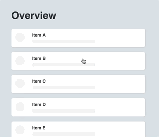

# react-transpose

[](https://www.npmjs.com/package/react-transpose)

react-transpose is a set of tools which helps you animate route or component transitions. It also enables you to animate shared-element transitions.

This package makes use of the awesome library [popmotion](https://github.com/Popmotion/popmotion/tree/master/packages/popmotion) for it's animations. This means that under the hood it uses the same spring / tween / etc.. animations types, and since this is a react package, it has some strong simularities with [react-pose](https://github.com/Popmotion/popmotion/tree/master/packages/react-pose). In a way, this package can be seen as an extension on top of react-pose.

## Why not use PoseGroup?

While PoseGroup is excellent in most use-cases probably way more suffisticated, sometimes it's hard to handle route specific configuration. What if you wanted to animate the entering direction of a component based on the route it was comming from? That's where react-transpose comes in: for each transition-state (enter / exit) it gives you additional props for acting on specific route-transitions.
On top of that this package provides tools to create so called shared-element transitions.

## Install

```bash
npm install --save react-transpose
```

or

```bash
yarn add react-transpose
```

This package has a peer-dependency on [popmotion](https://github.com/Popmotion/popmotion/tree/master/packages/popmotion), so make sure to install this package together with popmotion@^8.6.0. If your project is using popmotion's [react-pose](https://github.com/Popmotion/popmotion/tree/master/packages/react-pose) there is no need to install popmotion since react-pose already has a dependency on it.

## Usage

### Simple demo


[](https://codesandbox.io/s/reacttranspose-simple-demo-mdzvj?fontsize=14)

```jsx
import * as React from "react";
import { SwitchGroup, Stage, transposedShared } from "react-transpose";

const Box = transposedShared.div({
  // declare which style-props should be animated
  animationProps: ["width", "height", "backgroundColor"],
  // standard react-pose transition config
  transition: {
    // animation type (spring / tween / keyframes / etc...)
    type: "tween",
    duration: 300
  },
  // for identifying shared elements
  sharedKey: "box"
});

function App() {
  const [currentStage, setStage] = React.useState("route-a");

  // toggle stage every second
  React.useEffect(() => {
    const id = setInterval(() => {
      setStage(currentStage =>
        currentStage === "route-a" ? "route-b" : "route-a"
      );
    }, 1000);

    return () => clearInterval(id);
  }, []);

  return (
    <div style={{ position: "relative" }}>
      <SwitchGroup stage={currentStage}>
        <Stage
          stage="route-a"
          render={() => (
            <div style={{ position: "absolute" }}>
              <Box
                style={{ width: 100, height: 100, backgroundColor: "blue" }}
              />
            </div>
          )}
        />
        <Stage
          stage="route-b"
          render={() => (
            <div style={{ position: "absolute" }}>
              <Box
                style={{ width: 200, height: 200, backgroundColor: "red" }}
              />
            </div>
          )}
        />
      </SwitchGroup>
    </div>
  );
}
```

### Other demo's

- [Multiple Boxes demo](https://codesandbox.io/s/reacttranspose-boxes-example-slvqc)
- [List to Detail view - with react-router-dom](https://codesandbox.io/s/reacttranspose-listdetail-lu3u2)

## API

### SwitchGroup

It's main purpose is to render the right `<Stage />` out of one or multiple stages (paths/routes) given a current stage. It has a similar function to Switch in react-router.

| Prop     | type                    | required | Description                                                                 |
| -------- | ----------------------- | -------- | --------------------------------------------------------------------------- |
| children | ReactNode[]             | yes      | Must be one or more `<Stage />` elements                                    |
| stage    | string                  | yes      | the current stage                                                           |
| setStage | (stage: string) => void | no       | Use in combination with useStage to set a stage from deeper within the tree |

#### example

```jsx
import { SwitchGroup, Stage } from "react-transpose";

function App() {
  const [currentStage, setStage] = React.useState("a");

  return (
    <SwitchGroup stage={currentStage} setStage={setStage}>
      <Stage stage="a" render={() => <div>A</div>} />
      <Stage stage="b" render={() => <div>B</div>} />
    </SwitchGroup>
  );
}
```

### Stage

Used to represent a stage or path, much like a `<Route />` in react-router.
Use either the render or the component prop.

| Prop      | type               | required | Description |
| --------- | ------------------ | -------- | ----------- |
| stage     | string             | yes      |
| render    | () => ReactElement | no       |             |
| component | Component          | no       |             |

### useStage

Helper hook to set a stage from deeper within the tree. Note: the 'setStage' prop must be given to the `<SwitchGroup />` component.

```jsx
import { useStage } from "react-transpose";

function Route() {
  const { setStage } = useStage();

  return <button onClick={() => setStage("next")}>Goto next route</button>;
}
```

### Group

Similar to `<SwitchGroup />`, but lets you handle the routing mechanism. Useful in combination with react-router for example.

| Prop        | type         | required | Description                     |
| ----------- | ------------ | -------- | ------------------------------- |
| currentPath | string       | yes      | path of current location        |
| children    | ReactElement | yes      | Can only be one child at a time |

#### example with react-router

```jsx
function App({ location }) {
  return (
    <Group currentPath={location.pathname}>
      <Switch location={location}>
        <Route exact path={"/"} component={Home} />
        <Route exact path={"/about"} component={About} />
      </Switch>
    </Group>
  );
}
```

### transposed

Function which creates components with animation capabilities.
As with libraries as styled-components and react-pose, you can either pass in a existing component (don't forgot to forward the ref to a dom-node), or a tag name.
So these all work:

```jsx
// existing component
import Box from "./Box";
const AnimatedBox = transposed(Box)({});

// argument string
const AnimatedBox = transposed("div")({});

// helper method
const AnimatedBox = transposed.div({});
```

#### Config

| Prop         | type                                          | required | Description                                                               |
| ------------ | --------------------------------------------- | -------- | ------------------------------------------------------------------------- |
| animateFirst | boolean                                       | no       | defaults to false. Determines whether to animate entering the first route |
| enter        | `object | (props: TransitionProps) => object` | yes      | see below                                                                 |
| exit         | `object | (props: TransitionProps) => object` | yes      | see below                                                                 |

The `enter` and `exit` prop takes either a function returning an object, or a plain object. It is almost the same as how [react-pose](https://popmotion.io/pose/learn/react-exit-enter-transitions/) does it. For example:

```jsx
const Box = transposed.div({
  enter: {
    // style props...
    opacity: 1,
    x: 0,
    backgroundColor: 'red',
    transition: { // info about transition
      type: "spring"
      stiffness: 200, // specfic spring prop
      damping: 25,  // specfic spring prop
      delay: 500 // different from react-pose
    }
  },
  exit: {
    opacity: 0,
    x: 100,
    backgroundColor: 'blue',
    transition: {
      type: "tween"
      duration: 400 // specific tween prop
    }
  }
})
```

When passing a function, you'll get a object with these properties

| Prop      | Type                           | Description                                                                                                                                                                                                                                                   |
| --------- | ------------------------------ | ------------------------------------------------------------------------------------------------------------------------------------------------------------------------------------------------------------------------------------------------------------- |
| path      | `{ from: string: to: string }` |                                                                                                                                                                                                                                                               |
| props     | object                         | Provides access to the wrapped component's props                                                                                                                                                                                                              |
| direction | `"in" | "out"`                 | Especially useful for `exit`. When entering, react-transpose looks at the exit state to determine where to animate from. In that case the direction is "in". When exiting, react-transpose looks at the exit state again, only this time with direction "out" |

For example:

```jsx
const Box = transposed.div({
  enter: ({ props }) => ({
    opacity: 1,
    x: 0,
    transition: {
      type: "spring",
      delay: props.index * 100 // staggering effect
    }
  }),
  exit: ({ path, direction }) => ({
    opacity: 0,
    // animate differently based on direction and path.from
    x: path.from === "a" && direction === "in" ? -100 : 300
  })
});
```

### transposedShared

Quite similar to transposed, but it's main purpose is to animate shared-element transitions.

#### Config

| Prop           | type                                                      | required | Description                     |
| -------------- | --------------------------------------------------------- | -------- | ------------------------------- |
| sharedKey      | `string | (props: object) => string`                      | yes      | for identifying shared elements |
| animationProps | string[]                                                  | yes      | style-props to be animated      |
| transition     | `object | (props: TransitionProps) => object`             | yes      | see below                       |
| whenNotShared  | `{ enter: object; exit: object; animatedFirst: boolean }` | no       | see below                       |

Example:

[](https://codesandbox.io/s/reacttransposed-transposedsharedexample-eukzq?fontsize=14)

```jsx
const Box = transposedShared.div({
  sharedKey: props => props.id,
  animationProps: ["x", "y", "width", "height"],
  transition: {
    type: "spring",
    stiffness: 400,
    damping: 30
  },
  // (optional) practically same as transposed config
  whenNotShared: {
    enter: { opacity: 1 },
    exit: { opacity: 0 }
  }
});

const BoxContext = React.createContext();

function List() {
  const { gotoDetail } = React.useContext(BoxContext);

  return (
    <div>
      <Box id="1" onClick={() => gotoDetail("1")} />
      <Box id="2" onClick={() => gotoDetail("2")} />
      <Box id="3" onClick={() => gotoDetail("3")} />
      <Box id="4" onClick={() => gotoDetail("4")} />
    </div>
  );
}

function Detail() {
  const { gotoList, selectedBox } = React.useContext(BoxContext);

  return (
    <>
      <button onClick={gotoList}>Back</button>
      <Box id={selectedBox} />
    </>
  );
}

function App() {
  const [state, setState] = React.useState({
    stage: "list",
    selectedBox: null
  });

  const payload = React.useMemo(
    () => ({
      ...state,
      gotoDetail: box => setState({ stage: "detail", selectedBox: box }),
      gotoList: box => setState({ stage: "list", selectedBox: null })
    }),
    [state]
  );

  return (
    <BoxContext.Provider value={payload}>
      <SwitchGroup stage={state.stage}>
        <Stage stage="list" component={List} />
        <Stage stage="detail" component={Detail} />
      </SwitchGroup>
    </BoxContext.Provider>
  );
}
```

## License

MIT © [everweij](https://github.com/everweij)
